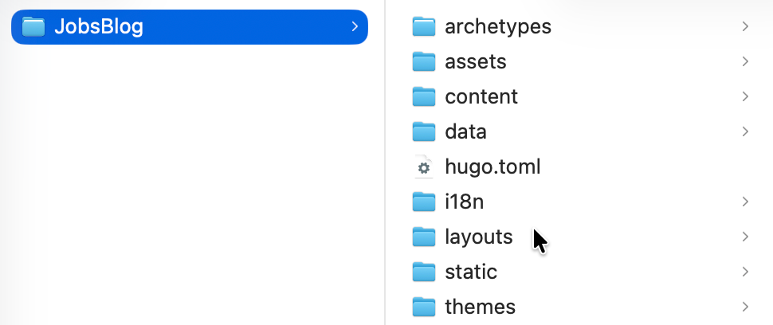
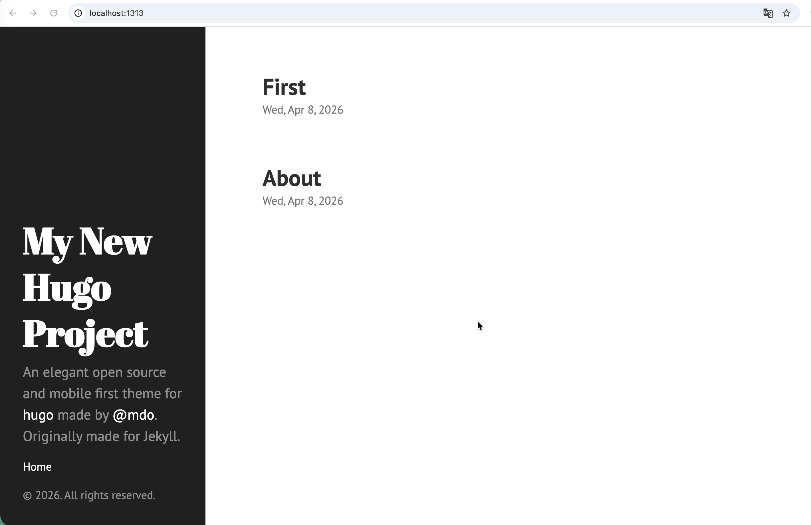

# 利用[Hugo](https://gohugo.io/)生成静态网页教程


[toc]
[Hugo中文文档](https://www.gohugo.org/)

 ## 一、核心特点

> **没有后端、没有数据库、速度极快**


## 1、环境配置

* 推荐终端：[**Oh-My-Zsh**](https://ohmyz.sh/)

  ```shell
  sh -c "$(curl -fsSL https://raw.githubusercontent.com/ohmyzsh/ohmyzsh/master/tools/install.sh)"
  ```

* [**Homebrew**](https://brew.sh/)

  ```shell
  /bin/bash -c "$(curl -fsSL https://raw.githubusercontent.com/Homebrew/install/HEAD/install.sh)"
  ```

## 2、安装配置

* 推荐利用[**Homebrew**](https://brew.sh/)自动安装配置[**Hugo**](https://gohugo.io/)

  ```
  brew install hugo
  ```

* 验证

  ```
  hugo version
  ```

## 3、生成站点

* `hugo new site JobsBlog`

  ```shell
  Last login: Wed Apr  8 10:28:06 on ttys000
  ➜  Desktop hugo new site JobsBlog
  Congratulations! Your new Hugo project was created in /Users/jobs/Desktop/JobsBlog.
  
  Just a few more steps...
  
  1. Change the current directory to /Users/jobs/Desktop/JobsBlog.
  2. Create or install a theme:
     - Create a new theme with the command "hugo new theme <THEMENAME>"
     - Or, install a theme from https://themes.gohugo.io/
  3. Edit hugo.toml, setting the "theme" property to the theme name.
  4. Create new content with the command "hugo new content <SECTIONNAME>/<FILENAME>.<FORMAT>".
  5. Start the embedded web server with the command "hugo server --buildDrafts".
  
  See documentation at https://gohugo.io/.
  ```

* 目录结构

  ```
  JobsBlog/
  ├── content/     # 文章
  ├── themes/      # 主题
  ├── static/      # 静态资源
  ├── config.toml  # 配置
  ```
  
  

### 3.2、创建一些页面资源

* 创建文章页面

  ```shell
  hugo new about.md
  ```

* 创建第一篇文章，放到 `post` 目录，方便之后生成聚合页面

  ```shell
  hugo new post/first.md
  ```

### 3.3、安装皮肤

* 进入`themes`文件夹

  ```shell
  git clone https://github.com/spf13/hyde.git
  ```

## 4、运行`Hugo`

### 4.1、本地运行



* 跳出`themes`文件目录，并且回到`Test_Hugo`目录，执行命令：

  ```shell
  hugo server --theme=hyde --buildDrafts
  ```

  ```shell
  Last login: Wed Apr  8 10:48:22 on ttys000
  ➜  Desktop /Users/jobs/Desktop/JobsBlog 
  ➜  JobsBlog hugo server --theme=hyde --buildDrafts
  Watching for changes in /Users/jobs/Desktop/JobsBlog/archetypes, /Users/jobs/Desktop/JobsBlog/assets, /Users/jobs/Desktop/JobsBlog/content/post, /Users/jobs/Desktop/JobsBlog/data, /Users/jobs/Desktop/JobsBlog/i18n, /Users/jobs/Desktop/JobsBlog/layouts, /Users/jobs/Desktop/JobsBlog/static, /Users/jobs/Desktop/JobsBlog/themes/hyde/archetypes, /Users/jobs/Desktop/JobsBlog/themes/hyde/assets/css, /Users/jobs/Desktop/JobsBlog/themes/hyde/layouts/{_default,partials}, ... and 1 more
  Watching for config changes in /Users/jobs/Desktop/JobsBlog/hugo.toml
  Start building sites … 
  hugo v0.160.0+extended+withdeploy darwin/arm64 BuildDate=2026-04-04T13:32:34Z VendorInfo=Homebrew
  
  
                    │ EN 
  ──────────────────┼────
   Pages            │ 12 
   Paginator pages  │  0 
   Non-page files   │  0 
   Static files     │  2 
   Processed images │  0 
   Aliases          │  0 
   Cleaned          │  0 
  
  Built in 2 ms
  Environment: "development"
  Serving pages from disk
  Running in Fast Render Mode. For full rebuilds on change: hugo server --disableFastRender
  Web Server is available at http://localhost:1313/ (bind address 127.0.0.1) 
  Press Ctrl+C to stop
  ```

* 此时，页面服务（监听默认端口1313）已经开启，可以在浏览器里面进行访问

  > **注意：只要关闭Mac终端或者Ctrl+C，都会结束掉页面服务，导致 http://localhost:1313 无法打开**

  ```url
  http://localhost:1313
  ```

### 4.2、发布到[**GitHub**](https://github.com/)

* 首先在[**GitHub**](https://github.com/)上创建一个代码仓库，命名为：**`Jobs.github.io`** 

* 回到此项目的根目录，运行 ➤  `hugo --theme=hyde --baseURL="http://coderzh.github.io/"`

  ```shell
  ➜  JobsBlog git:(main) ✗ hugo --theme=hyde --baseURL="http://coderzh.github.io/"
  Start building sites … 
  hugo v0.160.0+extended+withdeploy darwin/arm64 BuildDate=2026-04-04T13:32:34Z VendorInfo=Homebrew
  
  
                    │ EN 
  ──────────────────┼────
   Pages            │ 10 
   Paginator pages  │  0 
   Non-page files   │  0 
   Static files     │  2 
   Processed images │  0 
   Aliases          │  0 
   Cleaned          │  0 
  
  Total in 10 ms
  ➜  JobsBlog git:(main) ✗ 
  ```

* 在该项目文件夹下面 ➤ **Setting** （上方标签） ➤ **Code and automation**（左侧边栏） ➤ **Pages**（原**GitHub Pages**）

* 创建并启动工作流 。上传到[**GitHub**](https://github.com/)后会被自动识别

  > 在项目根目录下新建`.github/workflows/deploy.yaml`

  ```yaml
  name: Deploy Hugo site to Pages
  
  on:
    push:
      branches:
        - main
    workflow_dispatch:
  
  permissions:
    contents: read
    pages: write
    id-token: write
  
  concurrency:
    group: pages
    cancel-in-progress: true
  
  jobs:
    build:
      runs-on: ubuntu-latest
  
      env:
        HUGO_VERSION: 0.145.0
  
      steps:
        - name: Checkout
          uses: actions/checkout@v4
          with:
            fetch-depth: 0
  
        - name: Setup Pages
          id: pages
          uses: actions/configure-pages@v5
  
        - name: Setup Hugo
          uses: peaceiris/actions-hugo@v3
          with:
            hugo-version: ${{ env.HUGO_VERSION }}
            extended: true
  
        - name: Build with Hugo
          run: hugo --minify --baseURL "${{ steps.pages.outputs.base_url }}/"
  
        - name: Upload artifact
          uses: actions/upload-pages-artifact@v3
          with:
            path: ./public
  
    deploy:
      needs: build
      runs-on: ubuntu-latest
  
      environment:
        name: github-pages
        url: ${{ steps.deployment.outputs.page_url }}
  
      steps:
        - name: Deploy to GitHub Pages
          id: deployment
          uses: actions/deploy-pages@v4
  ```

**可能需要等待几分钟，这个时候访问浏览器：https://jobskits.github.io/ 🍺成功🍺**